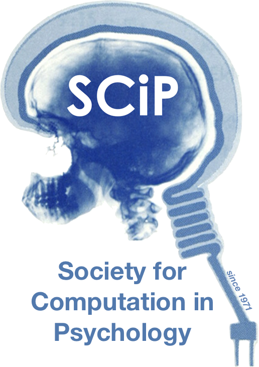

```{r echo = F, fig.align='center', fig.alt="SCIP Logo", out.height="300px"}

```

**Society for Computation in Psychology**. A forum for cutting-edge methods for the psychological sciences since 1971. *Computation, information, technology, statistics, applications and more!*

<form action="https://computationinpsych.us1.list-manage.com/subscribe/post?u=cf68d8e221bd6420be4cbc12b&amp;id=fe2a9dc1e9" method="post" id="mc-embedded-subscribe-form" name="mc-embedded-subscribe-form" class="validate" target="_blank" novalidate>

<label for="mce-EMAIL">Email Address </label>

<input type="email" value="" name="EMAIL" class="required email" id="mce-EMAIL">

<input type="text" name="b_cf68d8e221bd6420be4cbc12b_fe2a9dc1e9" tabindex="-1" value=""></div>

<input type="submit" value="Subscribe" name="subscribe" id="mc-embedded-subscribe" class="button">

</form>
